# Rockets and Feathers: Do Pump Prices Rise Faster Than They Fall?

An empirical study of asymmetric crude-oil-to-retail gasoline price pass-through in the US, 2010–2026, using weekly FRED/EIA data.

---

## 1. The question

When crude oil prices change, retail gasoline prices do not necessarily respond at the same speed in both directions. A crude price increase may reach the pump quickly, while a decrease may take longer to appear in retail prices.

This is the idea behind **“rockets and feathers”**: the claim that gasoline prices rise like a rocket when crude prices increase, but fall more slowly like a feather when crude prices decrease. In this project, the question is not whether the two prices move together in general, but whether the **speed and timing of pass-through differ between crude price increases and decreases**.

The main question is:

> **Do retail gasoline prices respond faster to crude price increases than to crude price decreases?**

Answering this requires more than comparing two price series. The data have to be aligned so that the retail observation is not paired with crude information that was not yet available. The response may also be spread over several weeks, so the lag structure needs to be measured before fitting the main model.

Once the short-run relationship is established, several follow-up questions become relevant:

* Is the difference mainly about **timing**, with the two directions reaching similar cumulative pass-through later, or does the cumulative response remain different?
* **Where in the supply chain** does the asymmetry appear — between crude and wholesale prices, or between wholesale and retail prices?
* Do crude and gasoline prices have a **long-run equilibrium relationship**, and if so, is the speed of adjustment different when prices are above versus below that relationship?
* Did the large **2026 crude-price episode** show a different up-versus-down response from the pattern estimated over the full sample?
* Does the national result also appear **across US regions**, or does the national average hide substantial regional differences?
* Does the pattern also appear when using **Brent instead of WTI** or **diesel instead of gasoline**?

These questions are tested separately. Some results are clear, while others are inconclusive or only provide limited support for the original hypothesis.

---

## 2. Research roadmap

The analysis follows the sequence in which the questions arise during the investigation.

| Stage                                    | What it does                                                                        | Why it is needed                                                                                                                                                                                |
| ---------------------------------------- | ----------------------------------------------------------------------------------- | ----------------------------------------------------------------------------------------------------------------------------------------------------------------------------------------------- |
| **Data + audit** (`01`, `02`)            | Pull the series and check what was actually collected                               | The models depend on the data being complete, correctly dated, and free of unexplained values                                                                                                   |
| **Point-in-time alignment** (`03`)       | Decide how to pair retail observations with upstream prices                         | Retail is observed on Monday, while weekly crude and wholesale prices are dated Friday; a naive same-week pairing can use information that was not available when the retail price was observed |
| **Lag structure** (`04`)                 | Measure how long crude-price changes take to appear in the next stages of the chain | The main model needs a lag length `K`, which is selected from the observed response rather than assumed                                                                                         |
| **Short-run asymmetry model** (`05`)     | Estimate separate responses to crude price increases and decreases                  | This is the main test of the rockets-and-feathers hypothesis                                                                                                                                    |
| **Robustness checks** (`05`)             | Test extreme weeks, alternative alignment, HAC windows, and lag length              | Shows which parts of the main result are stable and which are more sensitive                                                                                                                    |
| **Supply-chain decomposition** (`05` §7) | Estimate crude → wholesale and wholesale → retail separately                        | The direct crude → retail model cannot identify which link generates the asymmetry                                                                                                              |
| **Cointegration and ECM** (`06`)         | Test the relationship between price levels and their long-run adjustment            | The differences-only model measures short-run changes but does not describe the long-run relationship between price levels                                                                      |
| **2026 event study** (`07`)              | Test whether the 2026 rise-and-reversal episode differs from the baseline pattern   | A large and unusual crude-price movement may have produced a different short-run response                                                                                                       |
| **Regional analysis** (`08`)             | Refit the model for the five PADD regions                                           | A national average can hide differences between regional fuel markets                                                                                                                           |
| **Benchmark and fuel comparison** (`09`) | Repeat the analysis with Brent and with diesel                                      | Checks whether the main finding depends on the WTI benchmark or on gasoline specifically                                                                                                        |

The notebooks contain the implementation and detailed intermediate results. The README presents the reasoning and main evidence as one continuous analysis.

---

## 3. Data

### Source

The project uses **[FRED](https://fred.stlouisfed.org/) (Federal Reserve Bank of St. Louis)** as the only data API. Crude and wholesale spot series are available through FRED, while the retail gasoline and diesel series are EIA survey data distributed through FRED. No direct EIA API call is used. Both publishers release under "Public Domain: Citation Requested," free to use with attribution requested but not required.

Using FRED as the single API keeps data acquisition consistent across the different series while still using the underlying EIA retail survey data where applicable.

### Coverage

The analysis covers **2010-01-01 through the latest available observation** at the time of the data refresh. The raw series are fetched by `src/fetch_series.py`.

### The price chain

The main analysis follows three stages:

**Crude oil → wholesale gasoline → retail gasoline**

Each part of the chain has a specific role:

| Role                           | Series                            | Frequency            | Use                                   |
| ------------------------------ | --------------------------------- | -------------------- | ------------------------------------- |
| **Crude (core)**               | `WCOILWTICO`, `DCOILWTICO`        | Weekly-Friday, daily | WTI; main crude benchmark             |
| **Crude (robustness)**         | `WCOILBRENTEU`                    | Weekly-Friday        | Brent; used in `09`                   |
| **Wholesale spot (core)**      | `WGASUSGULF`                      | Weekly-Friday        | Gulf Coast wholesale gasoline         |
| **Retail gasoline (core)**     | `GASREGW`                         | Weekly-Monday        | US national average, regular gasoline |
| **Retail gasoline (regional)** | `GASREGECW`, `GASREGMWW`, `GASREGGCW`, `GASREGRMW`, `GASREGWCW`  | Weekly-Monday        | Used in `08`                          |
| **Diesel retail (comparison)** | `GASDESW`  | Weekly-Monday        | Used in `09`                          |

The full raw catalogue contains **29 series**, documented in `data/processed/series_manifest.csv`. Eleven of them enter a model. The remaining **18** — daily Brent, daily wholesale, the NY Harbor and Los Angeles hubs, all diesel spot series, regional retail diesel, and the conventional-formulation retail series — are pulled and audited in `01`/`02` but are not used by any model in this project.

### Why these series

The main question concerns how a crude-price change reaches the retail pump. That requires data at both ends of the chain and, for the supply-chain decomposition, at the wholesale stage in between.

The regional retail series allow the same question to be examined separately across the five PADD regions rather than relying only on the national average.

The diesel series in `09` provide a comparison with another refined fuel product. Brent provides a second crude benchmark, allowing the main result to be checked without changing the basic modeling approach.

### Frequency and dating

Retail gasoline is a **weekly Monday survey observation**, approximately at 8:00 a.m.; there is no daily retail equivalent in the data used here.

Crude and wholesale spot prices are available both daily and weekly. The weekly observations are dated **Friday** and represent the Monday-to-Friday average of the corresponding daily series.

This creates an important timing difference: the retail observation for a Monday is paired with upstream price information that has its own observation date and availability. The project therefore checks the timing explicitly before fitting the main model rather than assuming that observations with the same calendar week are automatically comparable.

---

## 4. Data acquisition and audit

Before fitting any model, Notebook `02` audits the raw data that was actually collected.

The audit found:

* **29 raw files**, one for each series in the manifest. The original value field is retained as text, including `"."` for missing observations.
* **13 retail series** with 866 weekly observations each and **no irregular gaps**: consecutive retail observations are exactly seven days apart.
* The expected weekday conventions hold: weekly-Friday observations are dated Friday and weekly-Monday observations are dated Monday.
* One negative crude-price observation: `DCOILWTICO` reached **−\$36.98/barrel on 2020-04-20**. This is a real market observation from the 2020 WTI price collapse and is retained rather than treated as a data error.
* There are **no negative wholesale spot or retail prices** in the audited data.
* Four weekend rows appear in the daily diesel spot data, but all four are null observations: Saturdays 2010-11-13 and 2010-11-20 in `DDFUELNYH` and `DDFUELUSGULF`. These are consistent with the absence of weekend market observations rather than unexpected weekend prices.

These checks are relevant to the later analysis. The lag models depend on regular weekly spacing, the alignment logic depends on the Monday-versus-Friday dating convention, and extreme observations need to be distinguished from data errors before they are used in the regression.

The 2020 negative WTI observation is therefore kept in the data and later appears as one of the extreme weeks considered in the robustness analysis.

Automated coverage checks are implemented separately in `tests/test_data_coverage.py`; Notebook `02` provides the readable audit of the actual values and coverage.

---

## 5. Point-in-time alignment

This is the methodological decision that most affects the results, so it was fixed before fitting any model (`03`, and ADR-0002 in `decisions.md`).

**The problem.** Retail is dated Monday and reflects a survey taken that morning. The weekly crude value is dated Friday and is the average of that week's Monday-through-Friday prices. Pairing a retail Monday with the Friday of its *own* calendar week therefore uses four trading days that had not happened yet when the survey was taken. That is look-ahead bias: information from the future is being used for an earlier observation.

Because this project is specifically about *timing*, this can change the measured lag structure. The response can appear one week later than it actually does.

**What was measured.** Three alignments were compared on the same data:

| Alignment                      | Rule                                                         | corr(Δretail, Δcrude) at lag 0 |
| ------------------------------ | ------------------------------------------------------------ | ------------------------------ |
| leaky (invalid, contrast only) | retail Monday ↔ same week's Friday                           | 0.209                          |
| **weekly (primary)**           | retail Monday ↔ most recent weekly Friday strictly before it | **0.591**                      |
| daily_pit (robustness)         | retail Monday ↔ last daily crude close strictly before it    | —                              |

Under the leaky pairing, the strongest relationship appears at **lag 1** rather than lag 0. The upstream observation has effectively been shifted one week forward, so the timing of the relationship is measured incorrectly. Under both valid alignments, the peak is at lag 0.

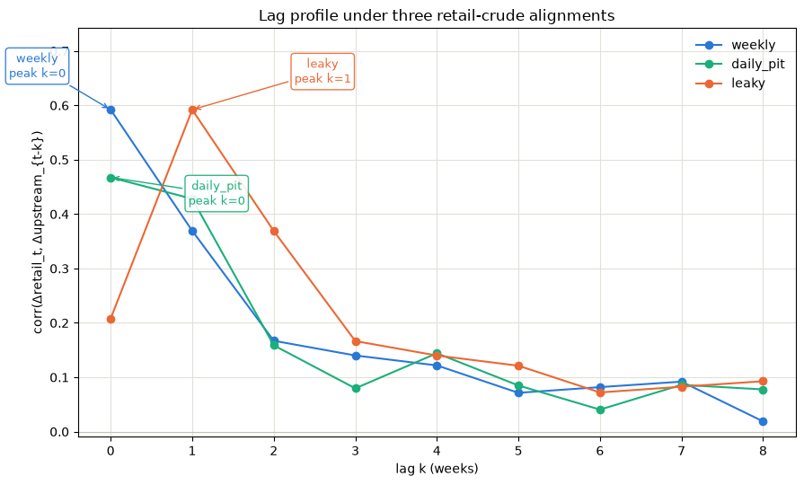

*The leaky series peaks one week later than the two valid alignments. The main difference is the timing of the peak, not simply a weaker correlation.*

**Weekly vs daily_pit.** These two valid alignments agree on the upstream date for **831 of 865** weeks. The 34 exceptions are holiday weeks, when the last trading day before the Monday survey is more than three calendar days earlier. There are 30 weeks with a 4-day gap and 4 weeks with a 5-day gap. The `4-day gaps` occur around Good Friday and Christmas week and the `5-day gaps` occur around Thanksgiving and the July 4th week. These differences come from the trading calendar rather than missing or irregular observations.

**How it is enforced.** Every retail-to-upstream join in the project uses the `align_retail_to_upstream` function (`src/point_in_time.py`). It raises an error if any upstream observation is dated on or after the retail survey date. The guard is covered by a test that passes deliberately leaky data and confirms that the function raises.

**Which alignment is used where.** `weekly` is the primary specification throughout. `daily_pit` is used as a robustness check for crude → retail (`05` §2c), and is required for the crude → wholesale link because weekly crude and weekly wholesale are both dated to the same Friday and cannot be paired under a rule requiring the upstream observation to be strictly earlier. No model using the `leaky` alignment was fitted. The purpose of the comparison is to show why the timing rule matters and to make sure it is applied consistently.

---

## 6. Lag structure

The distributed-lag model is fitted with a fixed number of lags, `K`, so that value has to be chosen before fitting. Choosing it arbitrarily could either leave out part of the response or add unnecessary lags, so `04` uses the data to determine a reasonable cutoff.

**Method.** For each link, the cross-correlation between the downstream weekly price change and the upstream price change is calculated at lags 0–12. The analysis uses differences rather than price levels. Price levels can be strongly correlated simply because both series trend over time, even when their week-to-week movements are not closely related. The main model is specified in differences for the same reason.

**Noise reference.** An approximate 95% band of ±1.96/√n ≈ **±0.067** is used as a reference, with n ≈ 864. This is a guide to the shape of the correlation profile, not a formal significance test. It assumes the differenced series behave like white noise, which is only approximately true here. Since 13 lags are examined for each pair, an occasional crossing of the band can occur by chance. We therefore do not treat an isolated crossing as evidence of a longer response unless nearby lags support it.

**Lag convention.** `lag 0` is the upstream price change in the same reference week as the downstream observation. `lag 1` is the upstream change one week earlier, `lag 2` is two weeks earlier, and so on. Thus, when the correlation at lag 1 is 0.369, it means the downstream change is being compared with the upstream change from the previous week. This is the same convention used by the distributed-lag model in `05`.

**Results and chosen lag lengths:**

| Link                             | Correlation profile                                                                         | Chosen K  |
| -------------------------------- | ------------------------------------------------------------------------------------------- | --------- |
| Crude → wholesale (daily_pit)    | 0.627 → 0.161 → 0.045, then scatter around zero                                             | **K_cw = 1** |
| Wholesale → retail (weekly)      | 0.730 → 0.483 → 0.208 → 0.167 → 0.157 → 0.100 → 0.074 → 0.048                               | **K_wr = 6** |
| Crude → retail (weekly, primary) | 0.592 → 0.369 → 0.167 → 0.140 → 0.122 → 0.071, then a small bump at lags 6–7 (0.082, 0.092) | **K_cr = 4** |

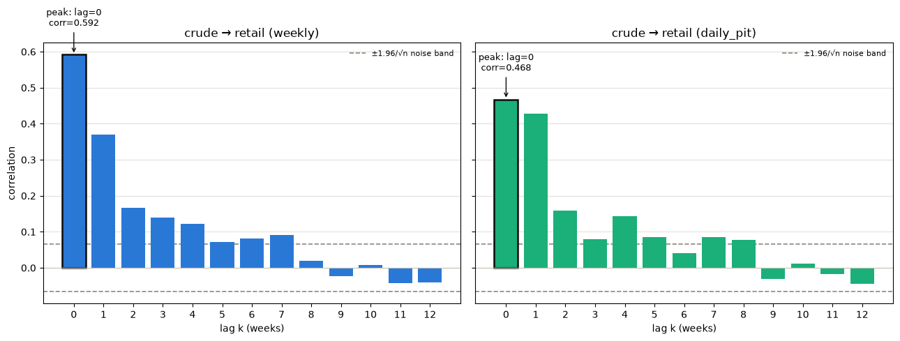

*Crude → retail, the pair used by the main model, under the weekly (left) and `daily_pit` (right) alignments. The dashed lines show the ±0.067 reference band. Under the weekly alignment, the correlation drops sharply after lag 0 and reaches the band around lag 5. The small lag 6–7 bump is isolated, so it is not used to extend K. Under `daily_pit`, lag 0 and lag 1 are much closer (0.468 vs. 0.428) than under the weekly alignment (0.592 vs. 0.369). This indicates that the choice of alignment affects how the response is split between the first two weeks.*

The crude → wholesale profile drops quickly: the correlation falls from 0.627 at lag 0 to 0.161 at lag 1 and 0.045 at lag 2. From there, the values fluctuate around zero, apart from an isolated value at lag 7. We therefore use **K_cw = 1**.

Wholesale → retail has a much slower decline, from 0.730 at lag 0 to 0.074 at lag 6 and 0.048 at lag 7. We use **K_wr = 6**, where the profile has reached the edge of the reference band.

For crude → retail, the correlation declines steadily through lag 4, from 0.592 to 0.122. Lag 5 is already close to the reference band, followed by a small bump at lags 6–7. Because that bump is not supported by the surrounding lags, it is not included in the primary model. `05` §6b later refits the model with **K = 6** as a sensitivity check.

As a consistency check, `K_cw + K_wr = 1 + 6 = 7` weeks is broadly in line with where the direct crude → retail correlation falls to around zero, at roughly lags 6–8. This is only a cross-check. It is not used to choose `K_cr`, and the three lag lengths should not be interpreted as a literal decomposition of the transmission time.

**Descriptive up/down response.** `04` also compares mean Δretail in the weeks following an up-week versus a down-week in crude. This is descriptive only. The weeks are split by the *direction* of the crude move, not its *size*. If up-weeks in the sample contain systematically larger crude moves than down-weeks, a difference in the average retail response could appear even with symmetric pass-through. This comparison therefore motivates the formal asymmetry test but cannot replace it.

---

## 7. The main model

The main model (`05`) estimates asymmetric pass-through using weekly first differences, with K = 4:

```
Δretail_t = α + Σ(k=0..K) β⁺_k · Δcrude⁺_{t-k} + Σ(k=0..K) β⁻_k · Δcrude⁻_{t-k} + ε_t
```

Each weekly crude price change is split into its positive and negative parts:

```
Δcrude⁺_t = Δcrude_t if crude rose that week, else 0

Δcrude⁻_t = Δcrude_t if crude fell that week, else 0
```

This is a decomposition, not a sample split: every week remains in the model, with only one of the two components non-zero.

The coefficients measure retail pass-through from crude price changes at different lags. Under the lag convention used throughout the project, `lag 0` is the same reference week and `lag 1` is the upstream change from the previous week. Because both prices are measured in \$/gal, the coefficients can be compared directly between the up and down directions.

**Cumulative pass-through** sums the coefficients from lag 0 through a given horizon:

```
cum_up(h)   = Σ(k=0..h) β⁺_k

cum_down(h) = Σ(k=0..h) β⁻_k

gap(h)      = cum_up(h) − cum_down(h)
```

This shows how much of a crude price change has passed through to retail by week h. Because `cum_up(h)` and `cum_down(h)` are each sums of several regression coefficients, and those coefficients are correlated with one another, the gap between them is tested using the full coefficient covariance matrix (`res.t_test`), so the covariance between lagged coefficients is taken into account.

**Standard errors.** The model uses HAC (Newey–West) standard errors are used instead of OLS's default ones, because the residuals are positively autocorrelated (Durbin–Watson ≈ 1.19). Plain OLS standard errors assume independence and would understate the true uncertainty here. `maxlags=6` sets how many weeks of that autocorrelation the correction accounts for, chosen as the standard rule of thumb for a sample this size (T ≈ 860). The HAC window is independent of `K`: `K` determines which lagged crude changes enter the model, while `maxlags` determines how much residual autocorrelation is accounted for when estimating the standard errors.

**Scope of the model.** This is a differences-only specification. It measures how weekly price changes pass through, but it does not test whether the price levels have a long-run relationship. That question is examined separately in `06`.

---

## 8. Main hypothesis and result

> **H1 (main).** Retail gasoline prices respond faster to crude price increases than to crude price decreases.

**Result: supported as a short-run timing effect.**

| Horizon | cum_up | cum_down |        gap |    p-value |
| ------- | ------ | -------- | ---------- | ---------- |
| h = 0   |  0.696 |    0.263 | **0.4333** | **0.0001** |
| h = 1   |   0.83 |      0.6 | **0.2331** | **0.0239** |
| h = 2   |   0.92 |     0.72 |     0.2055 |     0.0823 |
| h = 3   |   0.93 |     0.81 |     0.1169 |     0.3570 |
| h = 4   |   0.96 |     0.93 |     0.0303 |     0.8137 |

At h = 0, the model estimates about \$0.70 of retail pass-through for a \$1/gal crude increase, compared with about \$0.26 for a \$1/gal crude decrease. The difference is 0.433 (p = 0.0001).

The gap remains significant at h = 1 (0.233, p = 0.024), but not at h = 2 or later. By h = 4, cumulative pass-through is similar in the two directions (0.96 vs. 0.93), with no statistically detectable difference (p = 0.81).

**Interpretation.** The result is mainly about the **speed** of pass-through. Crude price increases reach retail faster, while decreases pass through more gradually. The model does not provide evidence of a difference in cumulative pass-through by h = 4.

This is the main short-run rockets-and-feathers result used in the rest of the project.

---

## 9. The shape behind the number

The cumulative difference between the two directions comes from how the estimated response is distributed across lags.

* **Up-response:** largest immediately, then falls quickly (0.696, 0.138, 0.088, then close to zero).
* **Down-response:** smaller at first (0.263), peaks one week later (0.338 at lag 1), and then continues at roughly 0.10–0.12 through lags 2–4.

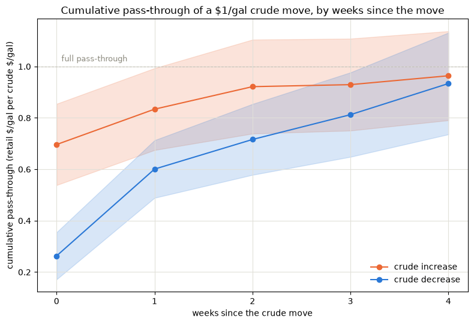

*The two cumulative curves start far apart at h = 0 and converge by h = 4. The gap closes because the down-response continues to accumulate after most of the up-response has already occurred.*

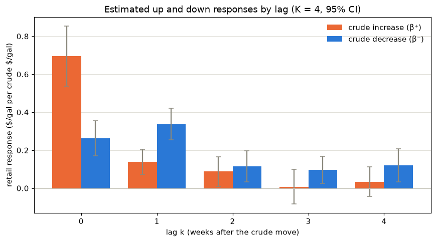

*The up-response is concentrated in lag 0, while the down-response is spread across several lags and is largest at lag 1.*

This is the rockets-and-feathers pattern found in the data: crude price increases pass through quickly, while decreases pass through more gradually. The difference is mainly in timing rather than in cumulative pass-through by h = 4.

---

## 10. Diagnostics and robustness

**Model diagnostics.** R² = 0.50. The Durbin–Watson statistic is 1.19, indicating positive residual autocorrelation and supporting the use of HAC standard errors. Jarque–Bera rejects normality, with skewness of 1.21 and kurtosis of 9.68. The condition number is 34.9, with no strong indication of problematic collinearity among the lagged regressors. The residuals remain centered around zero with no obvious trend or level shift, apart from isolated spikes in 2017, 2022, and 2026.

Four robustness checks were run. They do not all give the same level of support, so the distinction between h = 0 and h = 1 matters.

**Extreme weeks.** Weeks with |Δcrude| ≥ \$0.25/gal were flagged mechanically. This identifies 14 weeks, including the large 2020 and 2026 moves and the March 2022 spike. Refitting without them gives:

| Horizon | Full sample         | Extremes dropped                           |
| ------- | ------------------- | ------------------------------------------ |
| h = 0   | 0.4333 (p = 0.0001) | **0.2639 (p = 0.0034)**                    |
| h = 1   | 0.2331 (p = 0.0239) | **0.1446 (p = 0.174)**, CI [−0.064, 0.353] |
| h = 4   | 0.0303 (p = 0.81)   | 0.0728 (p = 0.67)                          |

This is the robustness check that changes the results most. The same-week gap becomes smaller but remains significant after excluding the 14 extreme weeks. The h = 1 gap loses significance.

**Alignment (`daily_pit`).** Under the daily point-in-time alignment, the h = 0 gap falls to 0.276 (p = 0.0085), while the h = 1 gap rises to 0.272 (p = 0.022). Both remain significant, and the difference has disappeared by h = 4.

The overall short-run result is similar, but the response is distributed differently between the first two weeks: the weekly alignment gives a larger h = 0 gap, while `daily_pit` gives a larger h = 1 gap. This shows that the exact timing of the estimated response is somewhat sensitive to how the upstream price is aligned with the Monday retail observation.

**HAC window.** Changing `maxlags` from 6 to 3 or 12 leaves the coefficient estimates unchanged; it only changes the standard errors and confidence intervals. The h = 0 and h = 4 results are stable across all three windows. The h = 1 result remains significant, but becomes marginal at `maxlags=3` (p = 0.045, CI lower bound 0.005).

**Lag length.** Refitting the model with K = 6 gives gaps of 0.442 at h = 0 and 0.237 at h = 1, compared with 0.433 and 0.233 at K = 4. The two additional lags therefore change the estimates by less than 0.01. Including the isolated lag 6–7 correlation bump in the model does not materially change the result.

**What is most robust.** The same-week result survives every check. The h = 1 result is less stable: it loses significance when extreme weeks are excluded and becomes marginal under a shorter HAC window. The main finding therefore rests on the same-week difference, while the evidence for an additional week-1 difference is more sensitive to specification.

---

## 11. Where in the chain does the asymmetry appear?

The direct crude → retail model shows the short-run asymmetry, but it does not show which link in the price chain accounts for the difference. `05` therefore estimates the same asymmetry test separately for crude → wholesale and wholesale → retail, using the lag length selected for each link in `04`.

| Link                    |  K |  h = 0 gap |           p |  h = 1 gap |           p | Final horizon               |
| ----------------------- | -: | ---------: | ----------: | ---------: | ----------: | --------------------------- |
| Crude → wholesale       |  1 |    −0.0908 |        0.44 |     0.0304 |        0.85 | —                           |
| Wholesale → retail      |  6 | **0.3577** | **<0.0001** | **0.3396** | **<0.0001** | −0.0597 (p = 0.39) at h = 6 |
| Crude → retail (direct) |  4 |     0.4333 |      0.0001 |     0.2331 |       0.024 | 0.0303 (p = 0.81) at h = 4  |

**Result.** The short-run asymmetry appears mainly in the **wholesale → retail** link. Crude → wholesale shows no detectable asymmetry at h = 0 or h = 1, while wholesale → retail shows a large and significant gap at both horizons. Its magnitude is also close to the gap in the direct crude → retail model.

**What this does not establish.** This identifies where the difference appears in the estimated price chain; it does not identify the underlying mechanism. Menu costs, consumer search frictions, or delayed competitive adjustment could potentially contribute to retail-stage asymmetry, but none of these explanations is tested in this project.

**Specification note.** The crude → wholesale model uses daily crude with `mode="daily_pit"` because weekly crude and weekly wholesale are both dated to Friday. They therefore cannot be paired under the strictly-before rule. Wholesale remains at weekly frequency so that it represents the same weekly price measure in both links of the chain, making the two estimates comparable.

This choice also means that the crude → wholesale test does not capture an asymmetry that occurs entirely within a single trading week.

---

## 12. Long-run relationship and error correction

`05` works entirely in weekly changes, so it focuses on short-run price movements rather than the relationship between price *levels*. `06` asks whether crude and retail prices also share a stable long-run relationship, and whether prices adjust back toward it when they move away from it.

**Method.** Three steps. First, ADF tests check whether each level series has a unit root. All series **fail to reject** the null of a unit root, so the level series are treated as non-stationary and the cointegration framework is appropriate. Second, the Engle–Granger procedure tests each link for cointegration — a stable long-run relationship in which the gap between the two series, `u_t = downstream_t − γ₀ − γ₁·upstream_t`, remains stationary. Third, for links that cointegrate, an error-correction model adds the lagged equilibrium error split into positive and negative parts, giving separate adjustment speeds `λ⁺` (from above the long-run line) and `λ⁻` (from below).

**Cointegration results:**

| Link                   | coint stat | p-value    | γ₁     | Cointegrated at 5%? |
| ---------------------- | ---------- | ---------- | ------ | ------------------- |
| Crude → wholesale      | −4.2921    | 0.0026     | 1.1673 | Yes                 |
| Crude → retail         | −3.5030    | 0.0321     | 1.1025 | Yes                 |
| **Wholesale → retail** | −2.8062    | **0.1637** | 0.9567 | **No**              |

Since an ECM requires cointegration, wholesale → retail is excluded from the ECM analysis. This is notable because **the link that carries the short-run asymmetry is the one link for which cointegration is not supported in this sample**, so it cannot be analyzed with the ECM framework used here.

**Adjustment speeds in the two cointegrated links:**

| Link              | λ⁺ (`u_pos_lag1`)   | λ⁻ (`u_neg_lag1`)   | λ⁺ − λ⁻ | p      |
| ----------------- | ------------------- | ------------------- | ------- | ------ |
| Crude → wholesale | −0.0702 (p = 0.048) | −0.0399 (p = 0.055) | −0.0303 | 0.5291 |
| Crude → retail    | −0.021 (p = 0.25)   | −0.006 (p = 0.59)   | −0.0144 | 0.5740 |

Both coefficients are negative in both links, consistent with correction back toward the long-run relationship. In both links `|λ⁺| > |λ⁻|`, meaning that adjustment from above the long-run line is nominally faster. This is opposite to the direction expected under the rockets-and-feathers interpretation, but **the difference is not statistically significant in either link** (p = 0.53 and p = 0.57). The point estimates therefore do not provide evidence of asymmetric long-run adjustment.

> **H2 (long-run).** The speed of error correction differs depending on whether prices are above or below the long-run relationship.
>
> **Result: not supported.** There is no statistically significant evidence of asymmetric long-run error correction in either cointegrated link.

**Does the short-run result remain?** Adding the equilibrium-error term leaves the crude → retail short-run gap essentially intact: 0.452 at h = 0 (p < 0.001) and 0.278 at h = 1 (p < 0.03), compared with 0.433 and 0.233 in the plain model.

The ECM R² is 0.44 for crude → wholesale and 0.51 for crude → retail.

**The distinction to carry forward:**

* **Short run:** evidence of asymmetric repricing speed.
* **Long run:** no statistically significant evidence of asymmetric error correction.

The results support a **short-run difference in repricing speed, but not asymmetric long-run error correction**.

---

## 13. The 2026 crude episode

**Why look at it separately.** 2026 contains the largest large-scale rise and reversal in crude prices in the sample. The main model treats all weeks in the same way, so it does not allow the response during this particular episode to differ from the rest of the sample. `07` tests whether the up-versus-down asymmetry was different during 2026.

**Window definition.** The primary window covers retail Mondays from **2026-03-09 to 2026-07-06**: 18 weeks, with **9 up-weeks and 9 down-weeks**. The window was chosen around a cluster of weeks with weekly Δcrude above 3 standard deviations (2026 has 7 such weeks, the largest cluster in the sample). It also captures a full rise and reversal: crude was 1.568 before the window, reached 2.516, and fell back to 1.678 by the end of the window, an 88% retracement. Retail prices also rose and then gave back part of the increase, from a peak of 4.500 to 3.777.

The balanced 9/9 split is important because the event study compares the response to crude increases and decreases. The other candidate windows did not provide the same balance between the two directions. A separate crude climb begins in mid-July, after the primary window, and is not included.

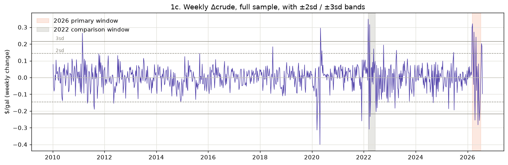

*Weekly Δcrude over the full sample, with the 2026 primary window and the 2022 comparison window shaded. The 2026 window covers the densest cluster of weeks above the ±3 SD threshold in the sample. The single largest weekly move remains the 2020 crash.*

**Design.** The `05` model is extended with event interactions and fitted on the full 861-observation sample, so the normal response and the 2026-specific deviation are estimated together. The event marker is attached to the crude shock rather than to the week when the retail response appears. This avoids labeling a delayed retail response as an event response when the underlying crude shock occurred before the event window.

Two specifications are used:

* **Spec A** — event interactions at lags 0–4 (10 event coefficients).
* **Spec B** — event interactions at lags 0–1 only (4 event coefficients), corresponding to the horizons where `05` found the strongest asymmetry. This restriction was chosen from `05` before looking at the 2026 event-study results.

Spec A is more flexible and can capture effects at later lags. Spec B has fewer event coefficients and is therefore more precise, but it would not capture an event effect that appears only at lags 2–4.

**Result.**

| Test                                        | Spec A                | Spec B               |
| ------------------------------------------- | --------------------- | -------------------- |
| Change in up-vs-down asymmetry              | 0.280 (p = 0.863)     | 0.161 (p = 0.808)    |
| Joint test, all event coefficients zero     | rejected (p < 0.0001) | rejected (p = 0.022) |
| Individually significant event coefficients | 3 of 10               | 0 of 4               |

> **H3 (2026).** The up-versus-down asymmetry changed during the 2026 crude episode.
>
> **Result: no statistically significant change.** The power of this test is discussed in §14.

The joint tests reject the null that all event-specific coefficients are zero, meaning that some part of the 2026 response differs from the normal response. This does not show that the up-versus-down asymmetry changed. In Spec A, three event coefficients are individually significant (lag-2 down, lag-3 down, and lag-4 up), but they occur at different lags and directions and do not form a clear pattern. Spec B has no significant event coefficients.

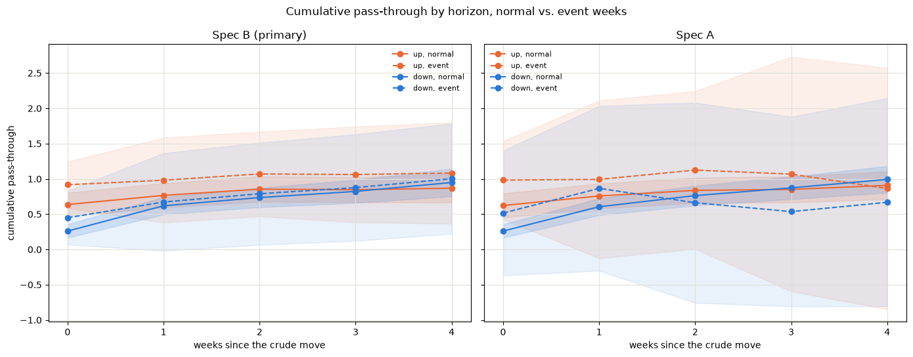

*The event and normal confidence bands overlap throughout the horizon, consistent with the non-significant asymmetry-change tests.*

**Comparison windows.** The same tests were run on two other large crude-price episodes to see whether the 2026 result is unusual relative to other periods of large price movements:

| Window            | Dates                   | Down-weeks | Result                                      |
| ----------------- | ----------------------- | ---------- | ------------------------------------------- |
| 2026 (primary)    | 2026-03-09 – 2026-07-06 | 9          | No change in asymmetry                      |
| 2022 (comparison) | 2022-03-07 – 2022-06-13 | 5          | Gap **narrowed**; Spec B −1.175, p < 0.0001 |
| 2020 (comparison) | 2020-03-16 – 2020-06-15 | 5          | No change in asymmetry                      |

The 2022 result is different from the other two windows. The estimated up-versus-down gap is smaller than normal in both specifications, and the Spec B result remains significant after removing the window's single largest crude move (the estimate changes from −1.175 to −1.448 and remains significant). In Spec B, both lag-1 event coefficients are significant and move the up-versus-down gap in the same direction. This gives the 2022 result a clearer short-run pattern than the individual significant coefficients in the 2026 and 2020 windows.

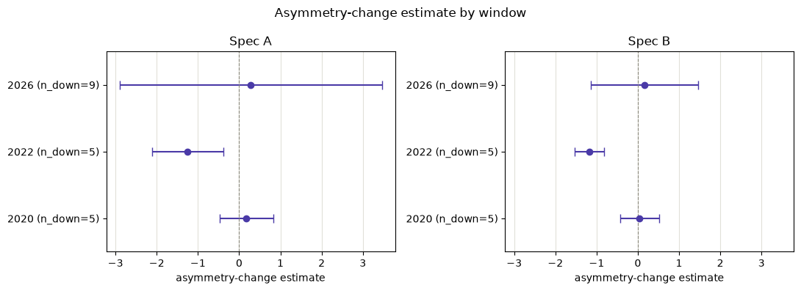

*The asymmetry-change estimate with its 95% interval, one row per window. The 2026 interval is wide and includes zero in both specifications, while the 2022 interval excludes zero and is on the negative side, indicating a narrower gap than normal.*

**The 2022 result is exploratory.** The window was chosen as a comparison case for 2026 rather than as a pre-specified test of 2022. It contains only 15 event weeks and 5 down-weeks, and three different windows were tested. The 2022 result should therefore be treated as evidence that warrants further investigation, rather than as a confirmed change in pricing behaviour.

The 2020 window needs a separate caveat. The COVID-19 demand collapse coincided with the crude-price crash, so the result may reflect the demand shock as well as pricing behaviour. It is therefore useful as a comparison with another highly disrupted period, but it is not a clean control.

---

## 14. What the 2026 event study could and could not detect

A null result is informative only to the extent that the test has enough statistical power to detect effects of a relevant size. Specification `07` therefore calculates the minimum detectable effect (MDE) at 80% power using a two-sided 5% significance level:

```
MDE = (z_0.975 + z_0.80) · SE ≈ 2.80 · SE
```

| Specification | MDE (per \$1/gal crude move) |
| ------------- | --------------------------: |
| Spec B        |                 ≈ \$1.86/gal |
| Spec A        |                 ≈ \$4.55/gal |

For context, the project's full-sample same-week gap is approximately **\$0.43/gal**. The comparison shows that the 2026 event-study design is not well powered to detect a change in asymmetry on the scale of the observed full-sample gap, particularly with only 18 event weeks.

**How to interpret the 2026 null result.** The result means that the analysis did not identify a change in asymmetry large enough to be detected with this specification and sample. It does **not** establish that asymmetry was unchanged in 2026, nor does it rule out a 2026-specific effect. Smaller or more moderate changes could remain undetected.

There are additional limitations at this stage. The event window ends on 2026-07-06, before a further crude-price increase that was still developing when the data were pulled. The 2020 comparison is also difficult to interpret because it coincides with the COVID-19 demand collapse.

---

## 15. Regional analysis

The national result combines five PADD regions (Petroleum Administration for Defense Districts) with different fuel markets and supply systems, so the national average may hide regional differences.

For example, PADD 3 (Gulf Coast) has a large concentration of US refining capacity, while PADD 5 (West Coast) is more isolated from the rest of the US fuel supply system and has additional fuel-blend requirements. This raises a simple question: **is the asymmetric response seen in the national data present across the country, or is it mainly driven by a few regions?**

`08` answers this question by running the same model used in `05` separately for each PADD region. The specification is unchanged: crude → retail, `K = 4`, weekly alignment, HAC standard errors with `maxlags = 6`, and 860 observations per region.
The three regional hypotheses were defined **before** looking at the regional results. This is especially important for H3: choosing a pair of regions only after seeing which results look different would make the comparison less reliable.

### H1 — Does each region show the pattern independently?

| Region                      | up (h=0) | down (h=0) | gap (h=0) | 95% CI           |          p |
| --------------------------- | -------: | ---------: | --------: | ---------------- | ---------: |
| PADD 1 East Coast           |   0.6638 |     0.2293 |    0.4345 | [0.202, 0.667]   |     0.0002 |
| PADD 2 Midwest              |   0.7836 |     0.3737 |    0.4099 | [0.196, 0.624]   |     0.0002 |
| PADD 3 Gulf Coast           |   0.7337 |     0.2909 |    0.4428 | [0.196, 0.690]   |     0.0005 |
| PADD 4 Rocky Mountain       |   0.5116 |     0.1938 |    0.3178 | [−0.004, 0.640]  | **0.0529** |
| PADD 5 West Coast           |   0.6111 |     0.1325 |    0.4786 | [0.190, 0.768]   |     0.0012 |
| *US (reference, from `05`)* | *0.6963* |   *0.2629* |  *0.4333* | *[0.221, 0.645]* |  *<0.0001* |


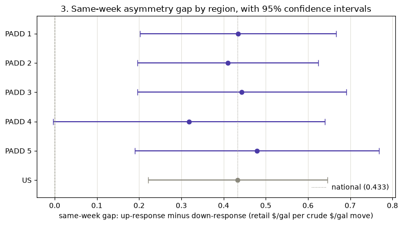

**Result: partially supported.** Four of the five regions show a statistically significant positive gap under the stricter 0.01 threshold. PADD 4 does not meet that threshold (p = 0.0529). This does **not** mean that PADD 4 has no asymmetry. Its estimated gap is still positive (0.3178), but the estimate is too uncertain to distinguish it statistically from zero at the chosen threshold. Its 95% confidence interval ranges from −0.004 to 0.640, meaning that both no gap and a substantial positive gap are consistent with the data.

The results therefore provide evidence that the pattern is present in most regions, but they do not show that one region is clearly more asymmetric than another. The confidence intervals overlap substantially, so the differences between the estimated regional gaps are small relative to the uncertainty in the estimates.

It is also important to look at the two responses behind the gap rather than only at the gap itself:

* **PADD 5 has the largest estimated gap (0.4786)**, but its upward response (0.6111) is actually below the national estimate (0.6963). Its large gap is mainly driven by its particularly small response when crude prices fall (0.1325).
* **PADD 4 has the smallest estimated gap (0.3178)**. Unlike PADD 5, both of its responses are relatively low: 0.5116 when crude prices rise and 0.1938 when they fall.

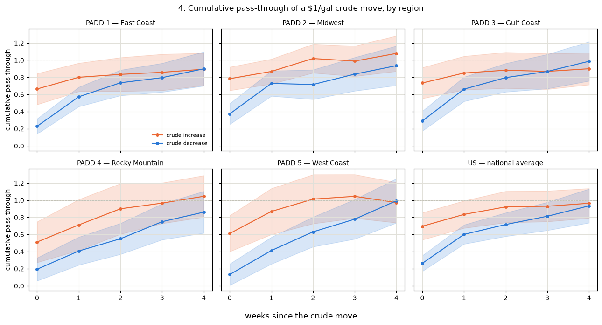

*The same gap, unpacked into the two responses behind it. What to notice: a single gap number can be produced two different ways, and the regions differ in which. PADD 5's wide gap comes from its blue (decrease) line starting lowest of any region, not from an unusually high orange line. PADD 4 sits low on both, which is why it shows the smallest gap despite being slow overall.*

### H2 — Do some regions resolve the gap later than others?

**Result: limited support.** PADD 5 is the only region where the gap remains statistically significant at `h = 2`. In all other regions, the gap is no longer statistically distinguishable from zero by that point.

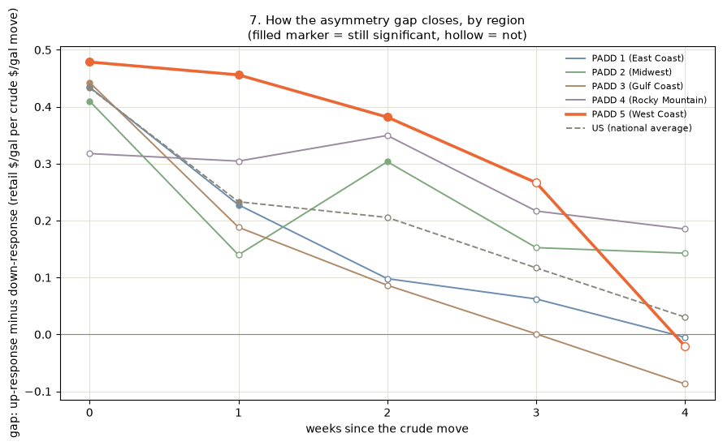

This provides evidence of slower resolution in **PADD 5 specifically**, but not of a general geographic pattern. This does not establish "farther from supply means slower" as a general rule. In particular, PADD 4 is comparably isolated and does not show persistence, although it never had a detectable gap to begin with.

### H3 — is PADD 5 specifically slower than PADD 3 on price *decreases*?

This test compares PADD 5 with PADD 3, representing a more isolated market and a more supply-connected market, respectively. The comparison was specified in advance, using the same-week (`h = 0`) difference in the response to crude-price decreases. A difference of \$0.10 per \$1/gal crude move was defined in advance as economically meaningful.

**Method.** To test the difference directly, the PADD 3 retail price series is subtracted from the PADD 5 series, and the same model is fitted to that difference. The resulting coefficient is PADD 5's response minus PADD 3's, so a negative estimate means PADD 5 responds *less*. This approach also accounts for the fact that the two regional price series may move together.

| Comparison (PADD 5 − PADD 3), h = 0 |   Estimate | 95% CI           |         p |
| ----------------------------------- | ---------: | ---------------- | --------: |
| **Down-response**                   | **−0.158** | [−0.282, −0.035] | **0.012** |
| Up-response                         |     −0.123 | —                |     0.023 |
| Up-minus-down gap                   |      0.036 | —                |     0.685 |

**Result: the proposed mechanism is not supported.** PADD 5 *is* significantly slower than PADD 3 on price cuts, meeting both the statistical significance threshold and the pre-specified $0.10 economic threshold. But it is almost exactly as slow on price *rises* (−0.123, p = 0.023), and the difference between the two directions is nowhere near significant (0.036, p = 0.685). **PADD 5 has slower same-week pass-through in both directions relative to PADD 3**, rather than being specifically slower on decreases. A gap-only test would have missed this entirely, since a similar slowdown on both sides cancels out of a gap.

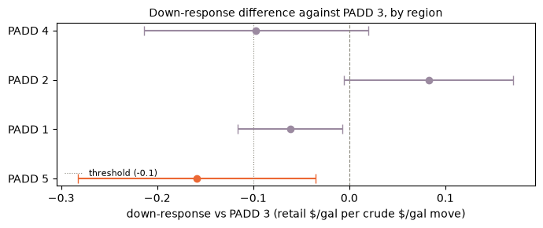

Repeating the same comparison for the other regions against PADD 3, only PADD 5 exceeds both the significance and \$0.10 economic thresholds. PADD 1 is significant but below the economic threshold (−0.062, p = 0.026); PADD 2 and PADD 4 are not significant. These comparisons are unadjusted for multiple testing.

**Power caveat.** The MDE is \$0.177, slightly larger than the estimated −0.158. The direction is supported, but the exact magnitude should be interpreted cautiously.

**At h = 1**, PADD 5 has caught up with PADD 3 on rises (0.018, p = 0.841) but falls further behind on cuts (−0.249, p = 0.002), which is closer to the proposed mechanism. This is treated as a secondary result because the week-1 estimates were less stable in `05`.

---

## 16. Benchmark and comparison checks

`09` runs two checks to assess how specific the main result is.

**Brent instead of WTI.** Using Brent instead of WTI gives a same-week gap of **0.3692 (p = 0.0011)** versus 0.4333 for WTI. The effect is smaller but the same pattern remains. By `h = 4`, the gap is indistinguishable from zero under both benchmarks. The result is therefore not specific to the choice of crude benchmark.

**Diesel instead of gasoline.** Diesel is refined from the same crude but sold through a separate retail market, so it provides a check on whether the pattern is specific to gasoline's retail market. Diesel's own cross-correlation crosses into the noise band a lag earlier than gasoline's (lag 3 at 0.089 is above the ≈0.067 band, lag 4 at 0.055 is inside it), so K = 3 was used rather than reusing gasoline's K = 4.

| Series | h = 0 gap | p | h = 1 gap | p |
|---|---|---|---|---|
| Gasoline (`05`, K = 4) | 0.4333 | 0.0001 | 0.2331 | 0.0239 |
| Diesel (K = 3) | **0.6889** | 0.0022 | **0.5002** | 0.0172 |
| Diesel (K = 4, sensitivity) | 0.6941 | 0.0027 | 0.5031 | 0.0198 |

Diesel shows an even larger asymmetric response than gasoline, and the result is unchanged if K = 4 is used instead of K = 3, so it is not an artifact of the shorter lag count.

**Conclusion:** the asymmetric pass-through pattern is **not specific to gasoline** and is not dependent on using WTI as the crude benchmark. The analysis does not determine where the asymmetry in the diesel market originates.

---

## 17. Hypotheses at a glance

| # | Hypothesis / question | Evidence | Status |
|---|---|---|---|
| H1 | Retail responds faster to crude increases than decreases (national, short run) | 0.696 vs 0.263 at h = 0, gap 0.4333 (p = 0.0001); gap closes by h = 4 (0.96 vs 0.93, p = 0.81) | **Supported**, as a short-run timing effect, no evidence of a permanent difference in cumulative pass-through |
| — | Where in the chain does it arise? | Crude→wholesale: −0.091 (p = 0.44). Wholesale→retail: 0.358 (p < 0.0001) | Concentrated in the **wholesale → retail** leg; mechanism not identified |
| H2 | Asymmetric long-run error correction | Wholesale→retail does not cointegrate (p = 0.164); where links cointegrate, λ⁺ − λ⁻ is not significant (p = 0.53, 0.57) and the point estimates run opposite to the prediction | **Not supported** |
| H3 | The 2026 episode changed the asymmetry | Asymmetry change 0.280 (p = 0.863, Spec A), 0.161 (p = 0.808, Spec B); MDE \$1.86–4.55 vs a \$0.43 headline gap | **Inconclusive** — no detectable change, but the design is underpowered to rule one out |
| — | 2022 comparison window | Gap narrowed, Spec B −1.175 (p < 0.0001), survives dropping the largest move | **Exploratory only** — comparison window, 15 weeks, three windows tested |
| Regional H1 | Each PADD shows the pattern individually | PADD 1, 2, 3, 5 significant at p < 0.01; PADD 4 p = 0.053 with a wide interval | **Partially supported** — four of five; PADD 4 inconclusive, not symmetric |
| Regional H2 | Some regions resolve the gap later | PADD 5 alone still significant at h = 2 | **Limited support** — one region, not a general geographic pattern; descriptive, not pre-specified |
| Regional H3 | PADD 5 is specifically slower than PADD 3 on price *cuts* | Down −0.158 (p = 0.012) but up −0.123 (p = 0.023); difference 0.036 (p = 0.685) | **Not supported as stated** — PADD 5 is slower in both directions, not specifically on cuts |
| — | Result depends on the crude benchmark | Brent same-week gap 0.3692 (p = 0.0011) | **Not supported** — benchmark choice does not drive the result |
| — | Pattern is specific to gasoline | Diesel same-week gap 0.6889 (p = 0.0022), larger than gasoline's | **Not supported** — the pattern is broader than gasoline |

---

## 18. Overall findings

**What the data support:**

* A short-run asymmetry in crude → retail pass-through: in the same week, roughly 70 cents of a \$1/gal crude increase reaches the pump, compared with roughly 26 cents of a decrease. The gap is 0.433 (p = 0.0001).
* The difference is mainly about **timing**. It remains significant at h = 1, then fades. By h = 4, cumulative pass-through is similar in both directions (0.96 vs. 0.93, p = 0.81).
* The asymmetry is concentrated in the **wholesale → retail** leg. There is no evidence of asymmetry in crude → wholesale.
* The same-week gap remains significant across the main robustness checks: after excluding the 14 most extreme crude weeks, under daily point-in-time alignment, across three HAC window widths, with a longer lag length, with Brent as the crude benchmark, and after adding the long-run error-correction term in the cointegrated crude → retail model.
* The pattern is not limited to the national gasoline result. It is significant in four of five PADD regions individually, and a similar, numerically larger same-week gap appears for retail diesel.

**What the data do not support:**

* A permanent difference in *total* pass-through between crude price increases and decreases.
* Asymmetric long-run error correction. The λ⁺ − λ⁻ difference is not significant in either cointegrated link, and the wholesale → retail link, where the short-run asymmetry is strongest, does not cointegrate in this sample.
* A demonstrated change in asymmetry during the 2026 episode. The event-study estimates do not detect a change, but the design is too underpowered to rule out a change of the size of the headline effect.
* The proposed competition-specific explanation for PADD 5. PADD 5 is slower than PADD 3 in both directions, not specifically for price cuts.

**What remains untested.** The analysis does not identify a causal mechanism behind the wholesale → retail asymmetry. Menu costs, search frictions, and delayed competitive adjustment are possible explanations, but none was tested, so the data cannot distinguish between them.

**The claim this project can defend**, stated precisely: *there is a robust short-run difference in the speed at which crude price increases and decreases reach the retail pump, concentrated in the wholesale-to-retail stage, which does not persist as a difference in cumulative pass-through and is not accompanied by statistically significant evidence of asymmetric long-run adjustment.*

---

## 19. Limitations

**Model scope.** The main model is specified in first differences. It describes how weekly price changes are transmitted and does not model the relationship between price levels. `06` examines the levels separately: two of the three links are cointegrated, but there is no evidence of asymmetric long-run adjustment.

**Week-1 estimates are less stable than same-week ones.** The h = 1 gap loses significance when the 14 extreme weeks are excluded and becomes marginal under the shortest HAC window. Results that rely on h = 1, including the PADD 5 result in `08`, are therefore weaker than the same-week results.

**Event-study power.** With 18 event weeks, the 2026 event study has an MDE of \$1.86–4.55 per \$1/gal crude move, compared with the project's headline gap of about \$0.43. The design therefore has limited power to detect a change in asymmetry of the size seen in the full sample. The 2026 null result should be read in that context.

**2026 window boundary.** The primary window ends on 2026-07-06. A further crude price climb starts shortly afterwards and is still unresolved at the end of the current sample, so that episode is not analysed.

**2020 confounding.** The COVID demand collapse coincided with the 2020 crude-price crash, so results from that comparison window may reflect the demand shock as well as pricing behaviour.

**2022 is exploratory.** The 2022 window was added as a comparison with 2026, not as a pre-specified test. It is one of three event windows examined, so the result should be treated as a comparison rather than as a standalone finding about pricing behaviour.

**Regional aggregation.** `08` works at PADD level: five multi-state regions rather than individual states. A null result at PADD level does not rule out an effect confined to one state within a region; it only means that such an effect is not large enough to appear in the regional average.

**Regional multiple testing.** Regional H1 tests five regions simultaneously, so the stricter 0.01 threshold is used. The four exploratory comparisons with PADD 3 in `08` §8 use unadjusted p-values and should be interpreted accordingly.

**Detection thresholds in `08`.** The regional design's MDE is \$0.177, larger than the \$0.10 threshold set as meaningful in advance. An effect at exactly the \$0.10 threshold therefore would not necessarily be detected.

**Alignment and holidays.** The weekly and daily point-in-time alignments differ on 34 of 865 weeks, all holiday weeks. The primary results use the weekly alignment. `daily_pit` shifts more of the estimated difference from h = 0 to h = 1, but the overall short-run conclusion is unchanged.

**No controls.** Gas taxes, seasonal summer-blend requirements, refinery outages, and ethanol content are not controlled for in the models.

**Data vintage.** EIA revises its weekly retail survey after first publication, and FRED serves the latest available vintage. Historical values therefore reflect later revisions rather than the values that were available at the time. This is appropriate for a historical price-transmission study, but not for a true real-time or point-in-time analysis.

---

## 20. Possible next steps

Each of these follows from a limitation above:

* **Richer ECM specifications.** The current ECM uses a single lagged equilibrium error split into positive and negative parts. Threshold or momentum-TAR specifications could allow the adjustment speed to depend on the size of the deviation, not only its direction.

* **Controls for omitted factors.** Gas taxes, seasonal blend transitions, refinery-outage data, and ethanol content could be added to separate these factors from the price-transmission pattern.

* **State-level analysis.** PADD aggregation is a known limitation of `08`. State-level retail series could test whether the PADD 5 result is broadly regional or driven by particular state markets.

* **Revisit 2026 once the episode is complete.** Once the later crude climb has resolved, a longer or second event window could be analysed. The window should be defined in advance rather than selected after seeing which period produces the strongest result.

* **Locate diesel's asymmetry in its own chain.** `09` shows a same-week diesel gap at least as large as the gasoline gap, but the diesel chain is not split into crude → wholesale and wholesale → retail as it is for gasoline in `05` §7.

* **Examine intra-week timing at the wholesale stage.** Wholesale is kept at weekly frequency in the current analysis, so the crude → wholesale test cannot detect an asymmetry that occurs within a week. Daily wholesale data is available in the manifest, but using it would require a separate point-in-time alignment rule to determine which daily wholesale observation was available before each retail observation.

---
## 21. Reproducing the analysis

```
pip install -r requirements-dev.txt
```

`data/processed/` is committed, so the notebooks can be run and the reported results reproduced without an API key. Run `notebooks/01_explore_fred.ipynb` through `notebooks/09_benchmark_and_comparison_checks.ipynb` in order. Note that `01` calls the live FRED API as a connection check; `02`–`09` read only from `data/processed/`.

To refresh the underlying data instead of using the committed snapshot, copy `.env.example` to `.env`, add a free FRED key, then:

```
python -m src.fetch_series
python -m src.build_tidy_tables
```

Tests that do not require network access or rebuilt data can be run with plain `pytest`.
`pytest -m data` additionally checks `data/processed/*.csv` after the pipeline has run, and `pytest -m integration` hits the live FRED API.

---

## 22. Notebook map

The narrative above is self-contained. Open a notebook if you want the underlying analysis or implementation details.

| #    | Notebook                                | Purpose                         | Open it for                                                                                                             |
| ---- | --------------------------------------- | ------------------------------- | ----------------------------------------------------------------------------------------------------------------------- |
| `01` | `01_explore_fred.ipynb`                 | API and manifest check          | FRED client functions, series metadata, and the first look at the three core series                                     |
| `02` | `02_data_pipeline.ipynb`                | Read-only data audit            | Row-level coverage tables, negative-price and weekend-null rows, and gap checks                                         |
| `03` | `03_point_in_time.ipynb`                | Alignment decision              | The worked alignment example, three-way lag-profile comparison, holiday gap distribution, and guard test                |
| `04` | `04_lag_structure.ipynb`                | Lag selection                   | Full cross-correlation tables and charts for each link, noise-band reasoning, and the descriptive up/down response      |
| `05` | `05_asymmetry.ipynb`                    | Main model                      | Full regression output, four robustness checks, residual diagnostics, and supply-chain decomposition                    |
| `06` | `06_error_correction.ipynb`             | Long-run analysis               | ADF and Engle–Granger results, ECM summaries, and the λ⁺ vs. λ⁻ test                                                    |
| `07` | `07_2026_event_study.ipynb`             | 2026 event study                | Window-selection tables, both specifications, joint and asymmetry-change tests, comparison windows, and MDE calculation |
| `08` | `08_regional.ipynb`                     | Regional comparison             | Per-region fits, H1/H2/H3 tables, the region-differencing method, and exploratory comparisons against PADD 3            |
| `09` | `09_benchmark_and_comparison_checks.ipynb` | Benchmark and comparison checks | Brent cross-correlation and fit, diesel lag selection, and K sensitivity                                                |

Supporting material: `decisions.md` records the analysis decisions and the reasoning behind them (ADR-0001 through ADR-0006). Implementation lives in `src/`:
`asymmetry.py` (the core model), `point_in_time.py` (alignment and its guards), `lag_structure.py` (cross-correlation), `cointegration.py` (ADF, Engle–Granger, ECM), `regional.py` (region differencing), and `series_manifest.py` (the series catalogue).

---

## References

Bacon, R. W. (1991). *Rockets and feathers: the asymmetric speed of adjustment of UK retail gasoline prices to cost changes.* Energy Economics, 13(3), 211–218. The paper that gave this pattern its name.

Borenstein, S., Cameron, A. C., & Gilbert, R. (1997). *Do gasoline prices respond asymmetrically to crude oil price changes?* Quarterly Journal of Economics, 112(1), 305–339. A key reference for the rockets-and-feathers question and the main earlier US gasoline-price study behind this project.

Bachmeier, L. J., & Griffin, J. M. (2003). *New evidence on asymmetric gasoline price responses.* Review of Economics and Statistics, 85(3), 772–776. Uses Engle–Granger methods with daily spot data; the `daily_pit` analysis in `03` and `05` addresses the related issue of timing and weekly aggregation.

Engle, R. F., & Granger, C. W. J. (1987). *Co-integration and error correction: representation, estimation, and testing.* Econometrica, 55(2), 251–276. The two-step procedure and critical values used for the cointegration analysis in `06`.

Bennett, J., Owyang, M. T., & Vermann, E. K. (2021). *Regional gasoline price dynamics.* Federal Reserve Bank of St. Louis Review, 103(3), 289–314. Used in `08` as a reference for regional gasoline-price dynamics and the finding that some US markets show no detectable asymmetry.